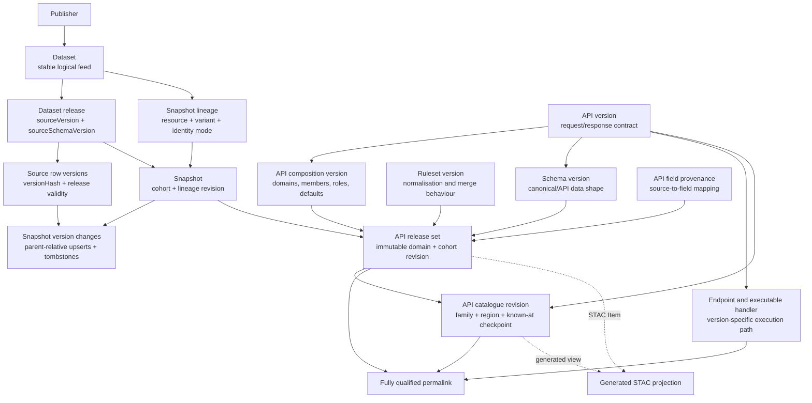
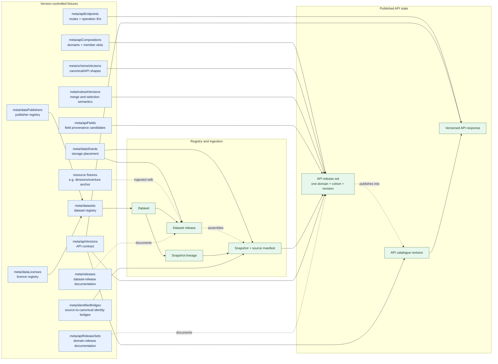
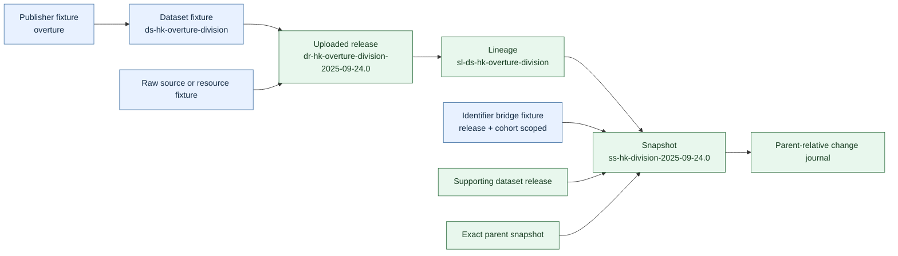
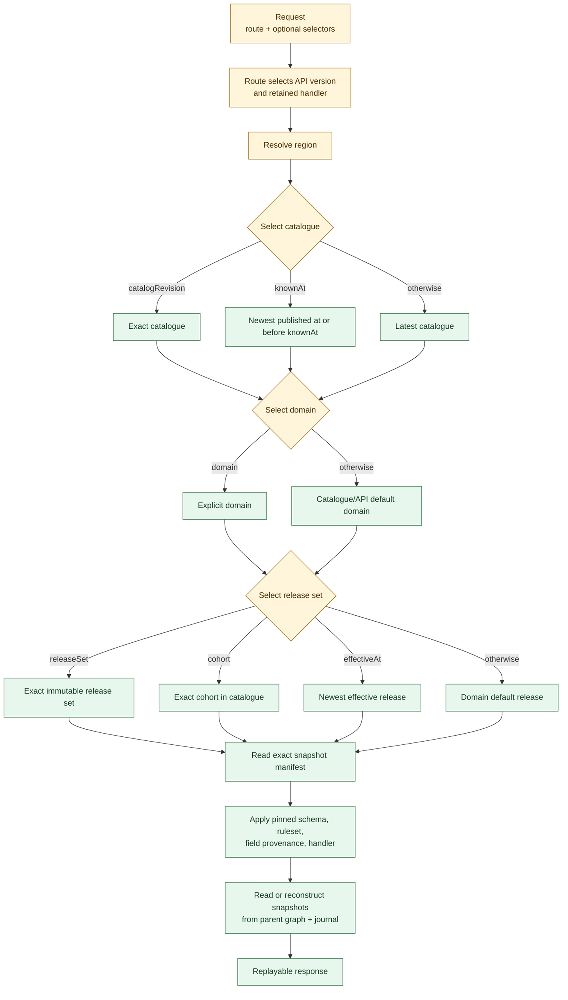
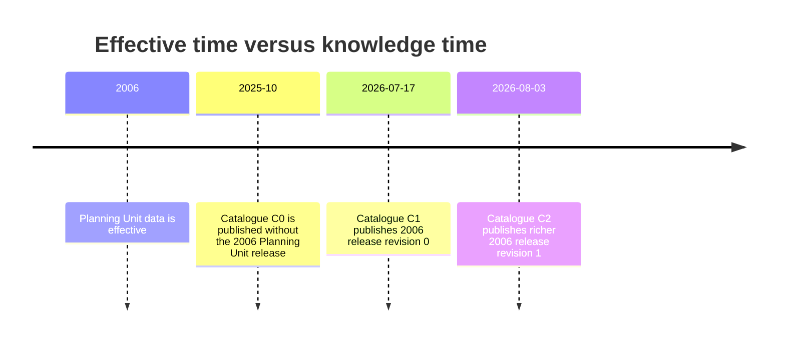

# Versioning and replay

## Purpose

This is the normative reference for versioning source data, assembled snapshots, API
domain releases, catalogue publications, API contracts, and executable handlers in
Saanseoi.

The model has two goals that must hold at the same time:

1. A user can identify and replay a published API view without relying on mutable
   defaults.
2. We can add sources, correct releases, and backfill old effective periods without
   rewriting an earlier publication.

The central rule is:

> A published object's semantic payload and membership are immutable. New knowledge
> creates a new object at the narrowest layer whose meaning changed.

Lifecycle annotations such as `superseded`, `revoked`, or `deprecated` may be added to
an old object. They describe its present selection policy; they do not alter what that
object contained when published.

This document complements:

- [`spec/atlas-data-model.md`](../spec/atlas-data-model.md)
- [`spec/atlas-api.md`](../spec/atlas-api.md)
- [`docs/datasets/families/divisions.md`](./datasets/families/divisions.md)

## Normative language

The words **MUST**, **MUST NOT**, **SHOULD**, **SHOULD NOT**, and **MAY** describe
requirements for stable API versions. The v0 routes remain explicitly experimental while
these guarantees are implemented end to end.

## Core invariants

- A dataset is a stable logical feed, not one monthly upload.
- A source release is immutable after publication. Corrections are new releases.
- A cohort describes when data applies; it does not describe when we learned about it.
- A published snapshot is immutable and belongs to one snapshot lineage.
- A published API release set is an immutable release of one domain and one cohort.
- Domains do not mix populations that cannot be returned together.
- An API catalogue revision is an immutable family-and-region statement of what was
  known at publication time.
- A new catalogue revision can point to a richer revision of an old cohort without
  changing earlier catalogue revisions.
- A stable API version retains a version-specific executable handler whenever a change
  can affect data selection, defaults, ordering, or response shape.
- Replay means equivalent data, shape, ordering, and resolved defaults. It does not mean
  byte-for-byte JSON serialization.
- Sequential version numbers and content hashes serve different purposes and MUST NOT be
  used interchangeably.

## The version hierarchy



The hierarchy is not a single number that increments from bottom to top. Each layer
answers a different question:

| Layer                   | Question answered                                                       |
| ----------------------- | ----------------------------------------------------------------------- |
| Dataset release         | Which publisher delivery did we ingest?                                 |
| Source row version      | Did the source record's content change?                                 |
| Snapshot                | Which assembled resource state applies to this lineage/cohort/revision? |
| Snapshot change journal | Which content versions differ from this snapshot's exact parent?        |
| Schema version          | What data fields and types exist?                                       |
| Ruleset version         | How were source values selected, normalised, and merged?                |
| API composition         | Which domains, variants, roles, and cohort rules are supported?         |
| API release set         | Exactly which snapshots form this domain at this cohort?                |
| API catalogue revision  | Which domain releases were known at this publication time?              |
| API version             | What request and response contract, defaults, and handler are promised? |

## Fixture map and selection paths

`fixtures/` is the version-controlled input to the registry and ingestion workflows; it
is not a second representation of every published object. In particular, an upload
creates dataset releases, snapshots, API release sets, and catalogue revisions. The
fixture files describe the stable registry entries, source-specific metadata, mapping
policy, and human-facing release notes that those workflows use.

The diagram separates **declared fixtures** (blue) from **published objects** (green).
Solid arrows are references or selection inputs; dashed arrows show a workflow that
creates an immutable published object.



The fixture groups have deliberately different jobs:

| Fixture group                                   | What it declares                                                        | What it does **not** select or create by itself                 |
| ----------------------------------------------- | ----------------------------------------------------------------------- | --------------------------------------------------------------- |
| `dataPublishers/`, `dataLicenses/`, `datasets/` | Stable publisher, licence, and logical-feed identities                  | A source release or snapshot                                    |
| `dataShards/`                                   | Where source/history/meta data is assigned                              | Which cohort or domain is returned                              |
| `apiVersions/`, `apiEndpoints/`                 | API contract identity and public route mapping                          | The data to return                                              |
| `apiCompositions/`                              | Domains and their required/optional resource-and-variant slots          | Exact snapshot IDs                                              |
| `schemaVersions/`, `rulesetVersions/`           | Shape and executable transformation/selection semantics                 | A publication checkpoint                                        |
| `apiFields/`                                    | A compatible field-provenance candidate                                 | A release set; it is resolved and pinned while one is published |
| `identifierBridges/`                            | Source-release/cohort-specific identity reconciliation                  | A cross-cohort identity guarantee for an unrelated lineage      |
| `releases/`, `apiReleaseSets/`                  | Human-facing documentation for generated release records                | The records themselves                                          |
| Resource fixtures outside `meta/`               | Source-specific ingestion inputs (for example, the Overture PRC anchor) | Registry policy or an API domain                                |

### From source fixture to snapshot lineage

Each dataset fixture points at one publisher and represents a stable feed. An uploaded
delivery becomes a release of that feed, then contributes to the lineage whose primary
dataset defines its identity scope. The exact selected releases, bridge use, and cohort
rule are recorded in the resulting snapshot's source manifest; they are not inferred
later from the current fixture tree.



The lineage is selected from the primary dataset, not from the API domain. A domain can
therefore combine snapshots from several lineages, while every individual snapshot
retains its own parent chain and effective cohort.

### Composition selects domain member slots

An API composition is the declaration that turns resource variants into a domain. It
does not select "the latest division dataset" globally. At publication time, Harbour
resolves one exact snapshot for each member slot and records those IDs in the API
release set. This is the current `comp-divisions-v1` shape in compact form:

```mermaid
flowchart TD
  Composition[comp-divisions-v1<br/>api-divisions-v0.1] --> Overture[domain: overture<br/>default]
  Composition --> PU[domain: hkgov-pland-pu]
  Composition --> NewTown[domain: hkgov-pland-new-town]

  Overture --> ODiv[division / overture<br/>primary, required<br/>exact_ref]
  Overture --> OArea[divisionArea / overture<br/>geometry, required<br/>exact_ref]
  Overture --> HadArea[divisionArea / hkgov-had<br/>geometry, required<br/>latest_at_or_before_cohort_per_dataset]
  Overture --> C2016[divisionArea / hkgov-censtatd:2016<br/>geometry, optional<br/>exact_ref]
  Overture --> C2021[divisionArea / hkgov-censtatd:2021<br/>geometry, optional<br/>exact_ref]
  Overture --> CSimple[divisionArea / hkgov-censtatd:2021:simplified<br/>geometry, optional<br/>exact_ref]
  Overture --> Boundary[divisionBoundary / overture<br/>geometry, required<br/>exact_ref]

  PU --> PUDiv[division / hkgov-pland-pu<br/>primary, required / exact_ref]
  PU --> PUArea[divisionArea / hkgov-pland-pu<br/>geometry, required / exact_ref]
  NewTown --> NTDiv[division / hkgov-pland-new-town<br/>primary, required / exact_ref]
  NewTown --> NTArea[divisionArea / hkgov-pland-new-town<br/>geometry, required / exact_ref]

  ODiv --> ReleaseSet[Generated API release set<br/>exact snapshot manifest]
  OArea --> ReleaseSet
  HadArea --> ReleaseSet
  C2016 --> ReleaseSet
  C2021 --> ReleaseSet
  CSimple --> ReleaseSet
  Boundary --> ReleaseSet

  classDef declared fill:#e8f1ff,stroke:#4a78a8,color:#142b44
  classDef generated fill:#e8f7ed,stroke:#39764a,color:#173d21
  class Composition,Overture,PU,NewTown,ODiv,OArea,HadArea,C2016,C2021,CSimple,Boundary,PUDiv,PUArea,NTDiv,NTArea declared
  class ReleaseSet generated
```



For a chosen domain/cohort, an `exact_ref` member must resolve to the exact anchored
cohort. The `hkgov-had` geometry member instead resolves independently for each of its
datasets to the latest cohort at or before the primary cohort. Required slots must be
present before publication; optional slots may be absent. The resulting release set
freezes the selected snapshots, so a later fixture edit or source upload cannot change
an existing release.

### Field-provenance fixture selection

`apiFields/` is intentionally more selective than the other registry fixture groups. It
supplies a candidate only when all of its compatibility keys match the draft domain
release. If several candidates match, the one anchored nearest to the primary snapshot
on that lineage's root-to-leaf path wins. The selected mapping is then copied into the
immutable release-set provenance record.

```mermaid
flowchart TD
  Draft[Draft domain release] --> Keys[Collect compatibility keys]
  Keys --> Version[apiVersion]
  Keys --> Domain[domainCode]
  Keys --> Shape[schemaVersion + rulesetVersion]
  Keys --> Sources[Exact source-dataset/schema signature]
  Keys --> Ancestry[Primary snapshot lineage ancestry]

  Fixture[apiFields fixture] --> Version
  Fixture --> Domain
  Fixture --> Shape
  Fixture --> Sources
  Fixture --> Anchor[lineageAnchorSnapshotVersion(s)]
  Anchor --> Ancestry

  Version --> Match{All keys match?}
  Domain --> Match
  Shape --> Match
  Sources --> Match
  Ancestry --> Match
  Match -->|no| Reject[Not applicable]
  Match -->|yes| Nearest[Choose nearest matching lineage anchor]
  Nearest --> Provenance[Pin field provenance<br/>in API release set]

  classDef fixture fill:#e8f1ff,stroke:#4a78a8,color:#142b44
  classDef generated fill:#e8f7ed,stroke:#39764a,color:#173d21
  class Fixture,Anchor fixture
  class Draft,Keys,Version,Domain,Shape,Sources,Ancestry,Match,Reject,Nearest,Provenance generated
```

### Request-time selection and replay

The server works from the top down. Fixtures establish the route and the policy already
pinned into published objects; the catalogue and release-set manifests make the final
selection immutable.



An explicit selector is exact: it never falls back to a different catalogue, domain,
cohort, release, or variant. A fully qualified permalink pins the API version, catalogue
revision, and release set, then follows this same path without consulting mutable
defaults.

## Concepts and identifiers

### Code grammar

Saanseoi-owned codes MUST use lowercase ASCII kebab-case. CamelCase remains valid for
programmatic schema enums and JSON field names, but those values are converted when
embedded in a code:

```text
divisionArea      -> division-area
divisionBoundary  -> division-boundary
```

Publisher, region, resource, product, domain, and variant are stored as structured
fields. Code strings are human-readable identifiers, not a substitute for those fields,
and application logic MUST NOT recover metadata by splitting, prefix matching, or suffix
matching a code.

Dataset and source-release codes use these grammars:

```text
ds-{region}-{publisherCode}-{resourceSlug}[-{productSlug}]
dr-{region}-{publisherCode}-{resourceSlug}[-{productSlug}]-{sourceVersion}
```

`dr` means dataset release. Keeping the prefix, region, publisher, resource, and product
segments in the same order as dataset codes makes the two namespaces visually
consistent; the provider-owned source version is appended because it versions that
dataset. The publisher segment is the exact registered publisher code.
`ds-hk-hkgov-had-...` is not redundant: `hk` is the dataset's geographic coverage, while
`hkgov-had` is the globally identified publisher. Externally governed identifiers, such
as SPDX licence IDs and upstream source versions, retain their authoritative spelling
and casing.

### Publisher

A publisher identifies the organisation or upstream system responsible for one or more
datasets, for example `overture`, `hkgov-had`, or `hkgov-pland`.

Publisher metadata has a `versionHash`, but it has no public chronological version. A
metadata edit updates the registry record and its hash; it does not create a data
release.

### Dataset

A dataset is a stable logical feed identified by `datasets.id` and `datasets.code`.

Examples:

```text
ds-hk-overture-division
ds-hk-overture-division-area
ds-hk-hkgov-had-division-area-district
ds-hk-hkgov-pland-division-pu
```

A monthly Overture delivery does not create a new dataset. It creates a release of the
existing dataset.

Create a new dataset when the logical feed, publisher ownership, region, resource type,
or independently versioned source product changes. Do not create a new dataset merely
because its rows, schema, URL, or publication date changed.

Dataset registry metadata has a `versionHash`. This detects configuration changes but is
not the source-data version exposed to users.

### Dataset release and `sourceVersion`

A release is one ingested delivery of a dataset. It records:

- `datasetId`
- `sourceVersion`
- `sourceSchemaVersion`
- `publicationDate`
- `cohortKey`
- raw object location
- lifecycle and supersession metadata

Example release codes:

```text
dr-hk-overture-division-2025-10-22.0
dr-hk-hkgov-had-division-area-district-2022
dr-hk-hkgov-pland-division-pu-2006
```

`sourceVersion` belongs to the source release namespace. Its form is provider-specific:

- `2025-10-22.0` for an Overture delivery
- `2022` for a HAD district release
- `2006` for a Planning Department historical release

The final `.N` in an Overture source version is an upstream/correction sequence. It is
not an API release-set revision and not a catalogue revision.

Within a dataset, `(datasetId, sourceVersion)` is unique. Where a provider defines an
ordering or correction suffix, preserve it, but do not use lexical source-version order
as Saanseoi's knowledge clock. If a published source release is corrected, register a
distinct correcting source version and connect the old release through
`supersededByReleaseId`. A correction may mark the old release revoked; an ordinary
newer release marks it superseded.

Releases MUST be ingestible out of source-version order. For example, a dataset with a
registered `2022` source release may later receive a genuine `2006` historical release.
The release keeps `sourceVersion=2006`, its effective cohort remains `2006`, and the
2026 catalogue publication supplies knowledge time. Do not invent a 2026 source version
merely to make the backfill sort last.

### Source schema version

`sourceSchemaVersion` describes the input contract of a dataset release, not our public
API schema.

It MUST change when the source columns, types, nesting, geometry encoding, or other
adapter-relevant input structure changes. It MAY remain stable across many source
releases.

A source schema change does not automatically require an API schema or API version
change. If the adapter continues producing the same canonical fields and semantics, only
the source schema and, when processing logic changed, the ruleset need to change.

### Content `versionHash`

`versionHash` is a deterministic hash of semantic content. It is used on registry
fixtures, source rows, canonical history rows, release sets, catalogues, and provenance
records.

It provides:

- change detection
- idempotent fixture synchronisation
- storage deduplication
- evidence that an immutable manifest has not changed

It does not provide ordering. A hash cannot answer whether one release is later than
another.

Source and canonical history tables retain a new row only when the semantic
`versionHash` changes. Unchanged entity rows are not copied for every release.

### Cohort key and effective time

`cohortKey` identifies the effective period represented by a release or snapshot. It is
an application-level identifier, not necessarily an instant.

Examples:

```text
2025-10-22.0  exact dated Overture cohort
2025-10        month cohort
2022           year cohort
2006           historical Planning Department cohort
```

Where possible, the cohort derives an `effectiveFrom` instant:

- date cohort → that date at `00:00:00Z`
- month cohort → the first day of the month
- year cohort → 1 January of that year

The cohort and effective time answer **when the data applies**. They do not answer when
Saanseoi ingested or published it.

### Snapshot lineage

A snapshot lineage identifies a logical stream of assembled resource snapshots. It is
scoped by:

- region
- resource type
- variant/source feed
- primary dataset
- identity mode

Example conceptual lineage codes:

```text
sl-ds-hk-overture-division
sl-ds-hk-hkgov-pland-division-pu
```

The code is `sl-{primaryDatasetCode}`. The dataset code already carries source, region,
and resource scope, so the lineage code does not repeat them. The separate lineage row
stores `regionCode`, `resourceType`, `variant`, `primaryDatasetId`, and `identityMode`
as queryable fields rather than asking consumers to parse the code.

Identity modes are:

| Mode            | Meaning                                                          |
| --------------- | ---------------------------------------------------------------- |
| `persistent`    | Entity identity is intended to remain comparable across cohorts. |
| `cohort_scoped` | Entity identity is meaningful only within one cohort.            |

Changing the primary dataset normally creates a new lineage. It MUST create a new
lineage if the identity namespace or cross-cohort identity guarantee changes.

#### How snapshot lineages are used

A lineage is an internal assembly and history boundary; it is not an API domain or a
public request selector.

1. On ingest, Harbour finds the lineage by its unique `primaryDatasetId`, or creates it
   deterministically from `sl-{primaryDatasetCode}`.
2. Every snapshot stores `snapshotLineageId` and a cohort-local `revision`.
3. The unique `(snapshotLineageId, cohortKey, revision)` tuple prevents two different
   assemblies from claiming the same position in the stream.
4. When the same dataset and cohort are assembled again after publication, Harbour finds
   the highest revision in that lineage and creates the next one.
5. `identityMode` tells history readers whether identifiers may be compared between
   cohorts (`persistent`) or only within a cohort (`cohort_scoped`).
6. An API release set selects exact snapshot IDs from one or more lineages. A catalogue
   selects the release set; neither layer copies the lineage's entity data.

The lineage code seeds its deterministic UUID. Snapshots reference that UUID, not the
human-readable code. Once a stable API publishes a lineage, both its code and UUID must
be treated as immutable; a genuinely different identity stream gets a new lineage.

### Snapshot

A snapshot is an assembled resource state for one `(lineage, cohort, revision)`.

Examples:

```text
ss-hk-division-2025-10-22.0
ss-hk-division-2025-10-22.0-r1
ss-hk-division-hkgov-pland-pu-2006
```

Revision zero omits the `-r0` suffix. `-r1` means the same lineage and cohort were
assembled again with different source membership or corrected content.

A snapshot records all selected source releases in `snapshotSources`, including:

- source dataset and release
- role
- selection rule
- source cohort
- anchor release

A published snapshot is immutable. A later correction to the same lineage and cohort
creates the next snapshot revision. Adding a supplementary dataset with its own lineage
may create that lineage's revision zero while still causing the enclosing API release
set to advance to its next revision.

Every snapshot also records `parentSnapshotId`:

- revision zero in a persistent-identity lineage uses the newest published earlier
  cohort in that lineage, if one exists;
- revision zero in a cohort-scoped lineage is a root, so ephemeral identities never leak
  between cohorts;
- revision `rN` uses `r(N-1)` for the same cohort;
- a lineage root has no parent.

This is a directed acyclic graph, not a validity range. A late 2006 backfill can branch
from the state before 2006 without pretending that it precedes already published 2022 or
2025 snapshots. Those later snapshots change only if they are explicitly rebuilt.

### Canonical content versions and snapshot change journal

Canonical history remains split into two compact layers. Existing version tables such as
`divisions`, `divisionsI18n`, `address2d`, and `divisionAreas` are retained as the
deduplicated **content store**. Their logical version key is the entity key plus
semantic `versionHash`; unchanged content is stored once and can be referenced by many
snapshots.

Those tables no longer contain `validFromSnapshotId`, `validToSnapshotId`,
`validFromCohortKey`, or `validToCohortKey`. A pair of range endpoints assumes one total
ordering and cannot say whether a same-cohort revision, late backfill, or later branch
contains a row. `snapshotId` and `isCurrent` remain only as mutable ingestion/cache
metadata. They MUST NOT be used as replay authority.

Snapshot membership is recorded in `snapshotVersionChanges`:

| Column            | Meaning                                                      |
| ----------------- | ------------------------------------------------------------ |
| `snapshotId`      | Snapshot whose parent-relative change is recorded            |
| `recordType`      | Content table kind, for example `division` or `divisionI18n` |
| `recordId`        | Stable entity identifier                                     |
| `locale`          | Locale for translated rows; empty string for non-i18n rows   |
| `operation`       | `upsert` or `delete`                                         |
| `versionHash`     | Exact content version for an upsert; null for a tombstone    |
| `sourceReleaseId` | Release responsible for the change                           |

Its primary key is `(snapshotId, recordType, recordId, locale)`. A retry replaces the
same draft change; publication makes the snapshot and its journal immutable.

To reconstruct a snapshot, walk `parentSnapshotId` from the requested snapshot to the
lineage root, then apply each snapshot's changes root-to-leaf. An upsert selects the
matching content-version row; a delete removes the key. Implementations may resolve the
same result more efficiently by walking leaf-to-root and taking the first change for
each key. Because the parent graph is stored in meta while content and changes may be
year-sharded, the resolver MUST follow recorded shard assignments rather than assuming
the parent lives in the same database.

`snapshotShardAssignments` records those locations explicitly. Ingestion writes the
history assignment with the draft snapshot; legacy assignments are backfilled from
source-release placement. The shared resolver validates the parent graph, applies each
assigned journal delta root-to-leaf, and retains the owning shard for every live content
hash. A missing binding is an error, never permission to use globally current rows.

Deleting a base record also removes its dependent i18n records from the reconstructed
state. When a base record remains but a locale disappears, the writer records an
explicit locale tombstone.

Before producing a child delta, an ingestion writer MUST compare against the exact
materialised parent snapshot, not whichever rows happen to have `isCurrent=1`. This is
what makes out-of-order backfills and revisions safe. `isCurrent` may be refreshed after
publication for operational convenience without changing replay.

### Schema version

The schema version describes the canonical/API data fields and their types for a domain
release.

Example:

```text
sv-division-v1
```

It changes when the data shape changes, including:

- adding or removing a field
- renaming a field
- changing a field type or nullability contract
- changing a resource's structural representation

Adding another dataset that supplies values to existing fields does not by itself change
the schema version.

The API version and schema version are related but not identical. One API contract may
serve several releases with the same schema, and a new API contract may reuse an
existing data schema while changing request syntax or defaults.

### Ruleset version

The ruleset version identifies executable data-selection and transformation semantics.

Examples:

```text
rs-division-merge-v1
rs-division-hkgov-pland-pu-merge-v1
```

It changes when observable values may change because we changed:

- source-to-canonical mapping
- normalisation
- precedence or merge logic
- identifier reconciliation
- cohort matching
- fallback behaviour
- geometry selection
- derivation logic

Rulesets SHOULD be domain-specific when domains use different sources or merge
semantics. The Overture ruleset retains its legacy code; new planning rulesets include
their domain.

A pure performance refactor that is demonstrated to preserve values and ordering does
not require a ruleset bump.

### API composition version

An API composition declares which resources may form an API domain release. It contains:

- domains
- default domain
- members per domain
- resource type and variant
- role
- required/optional status
- cohort matching mode
- priority and anchor rules

Example:

```text
comp-divisions, version 1
```

The composition version MUST increase when any of those declarations changes. Existing
published domain releases retain the composition ID under which they were built.

Changing a composition does not mutate or automatically rebuild historical domain
releases. We choose which cohorts to republish under the new composition.

### API field provenance

API field provenance records how fields in a particular domain release were produced:

- API field
- source dataset and path
- variant
- resolver
- contribution type and priority
- confidence

Field fixtures MUST declare a domain and are resolved against API version, domain,
schema, ruleset, the exact source-dataset/schema signature, and a parent-linked snapshot
branch. `lineageAnchors` binds each immutable snapshot anchor to its exact
source-dataset/schema signature. A mapping applies to an anchor and descendants reached
through `parentSnapshotId`, and never to a sibling or an independently backfilled
branch.

When more than one fixture matches the branch, the closest ancestor wins. Snapshot-code
or cohort ordering MUST NOT be used to infer fixture applicability.

### API release set: immutable domain release

Despite its historical name, an `apiReleaseSet` is one immutable domain release, not a
release containing every domain in the API family.

Its identity is:

```text
data-{region}-{family}-{cohort}[-r{revision}]--{domain}
```

Examples:

```text
data-hk-divisions-2025-10-22.0
data-hk-divisions-2006--hkgov-pland-pu
data-hk-divisions-2006-r1--hkgov-pland-pu
```

It binds:

- API version
- API composition version
- region
- domain
- effective cohort
- selected snapshots and variants
- schema version
- domain ruleset version
- field provenance

The composition's default domain is implicit. For divisions this is Overture, so
`data-hk-divisions-2025-10-22.0` means the Overture domain; non-default domains retain
their `--{domain}` suffix.

The trailing revision is a **domain-composition revision for that cohort**. It is not a
source correction number and not an API patch version.

For example, if a secondary dataset is added to the published 2006 Planning Unit
release:

```text
data-hk-divisions-2006--hkgov-pland-pu
                         ↓ new immutable composition
data-hk-divisions-2006-r1--hkgov-pland-pu
```

Revision 1 records `supersedesApiReleaseSetId` pointing to the implicit revision 0. The
unadorned initial revision remains addressable by catalogues that already published it.

`status=current` means this is the latest published composition for its
`(region, domain, cohort)`. Publishing a later revision archives its predecessor
(rendered as “superseded” in the registry). Multiple current release sets may still
exist across different cohorts and domains.

### API catalogue revision

An `ApiCatalogRevision` is an immutable publication checkpoint scoped to:

- API version
- family
- region
- publication time

Its identifier is:

```text
catalog-{region}-{family}-v{apiVersion}-{YYYY-MM-DD}.{revision}
```

Example:

```text
catalog-hk-divisions-v0.1-2026-07-17.0
catalog-hk-divisions-v0.1-2026-07-17.1
```

The date and `.N` describe **when catalogue manifests were published**. `.1` means the
second checkpoint on that date; it does not mean that `.0` was corrupt.

Each catalogue revision contains the domain release known for every published
`(domain, cohort)` and identifies one default release per domain. It may therefore
contain:

- monthly Overture cohorts
- five-yearly Planning Unit cohorts
- independently backfilled New Town cohorts

No common cohort across domains is required.

Publishing a richer revision of an old domain cohort creates a new catalogue revision
that replaces only that `(domain, cohort)` entry. The earlier catalogue continues to
point at the earlier domain-release revision.

Catalogue membership is metadata only. It does not duplicate entity rows.

### API version

An API version governs the externally observable request and response contract.

Example:

```text
api-divisions-v0.1
```

The route version controls:

- request parameters and accepted enum values
- response resources, fields, types, and relationships
- default domain, variants, includes, profile, and locales
- error semantics
- ordering and pagination semantics
- the executable handler path used to produce the response

For stable versions, use semantic versioning:

| Change                                                                                        | API version effect |
| --------------------------------------------------------------------------------------------- | ------------------ |
| Backward-compatible selector, domain, variant, profile, relationship, or optional field       | Minor              |
| Compatible bug fix whose observable behaviour must be distinguishable for replay              | Patch              |
| Removal, rename, incompatible type change, identity break, or materially incompatible default | Major              |
| Internal refactor with proven identical output                                                | None               |

v0 is intentionally mutable and provides no long-term compatibility guarantee while the
platform is built.

### Endpoint and handler version

Endpoint fixtures record public routes and operation IDs. They do not by themselves
freeze implementation behaviour.

A stable API version MUST dispatch through a retained version-specific handler module.
Shared implementation is allowed, but any component that can change observable data,
defaults, ordering, errors, or shape must either remain compatible or be versioned.

All handler versions run inside the same deployed Atlas Worker. Versioned execution
paths do not imply one Worker deployment per API version.

## Similar-looking suffixes

| Example                                     | Meaning                                                 |
| ------------------------------------------- | ------------------------------------------------------- |
| `sourceVersion=2025-10-22.1`                | Provider release or correction sequence                 |
| `ss-hk-division-2025-10-22.0-r1`            | Second snapshot assembly for one lineage and cohort     |
| `data-hk-divisions-2006-r1--hkgov-pland-pu` | Second immutable domain composition for the 2006 cohort |
| `catalog-hk-divisions-v0.1-2026-07-17.1`    | Second catalogue publication checkpoint on 17 July      |
| `api-divisions-v0.1.1`                      | API contract/handler patch version                      |
| `sha256:...`                                | Content identity, not chronology                        |

These counters are independent. Incrementing one MUST NOT mechanically increment the
others.

## Publication flow

For an ordinary upload, Harbour performs the following logical steps:

1. Resolve or create the stable dataset.
2. Register the immutable dataset release and its source version/schema.
3. Ingest source rows, retaining new content rows only where `versionHash` changed.
4. Resolve or create the dataset's snapshot lineage.
5. Resolve the snapshot's exact parent, materialise that state, and journal only the
   parent-relative upserts and tombstones needed for the draft snapshot.
6. Select exact, at-or-before, fallback, or other supporting snapshots according to the
   current composition.
7. Reuse a compatible draft domain release or create the next revision for that
   `(API version, region, domain, cohort)`.
8. Validate that all required composition members are present.
9. Bind schema, ruleset, source schema signature, and field provenance.
10. Publish the snapshot and immutable domain release.
11. Create a new API catalogue revision by copying the prior manifest and replacing the
    changed `(domain, cohort)` member.
12. Return both the domain-release code and catalogue-revision code to the uploader.

Draft snapshots and domain releases may be rebuilt during a failed or incomplete ingest.
Once published, they MUST NOT be updated in place.

## Effective time and knowledge time

Saanseoi uses bitemporal resolution.

| Time axis      | API selector                   | Meaning                             |
| -------------- | ------------------------------ | ----------------------------------- |
| Effective time | `cohort` or `effectiveAt`      | When the represented data applies   |
| Knowledge time | `knownAt` or `catalogRevision` | What Saanseoi had published by then |

Consider a Planning Unit dataset effective in 2006 that is first ingested in 2026:



Queries then resolve as follows:

| Query intention                                 | Selectors                                                  | Result                                                 |
| ----------------------------------------------- | ---------------------------------------------------------- | ------------------------------------------------------ |
| Latest available data                           | no temporal selector                                       | Latest catalogue, default domain release               |
| Data applicable in 2006 using today's knowledge | `domain=hkgov-pland-pu&effectiveAt=2006-01-01T00:00:00Z`   | Revision selected from the latest catalogue            |
| Exact effective cohort using today's knowledge  | `domain=hkgov-pland-pu&cohort=2006`                        | Latest published 2006 revision in the latest catalogue |
| What was known in October 2025                  | `knownAt=2025-10-31T23:59:59Z`                             | C0; no 2006 release                                    |
| 2006 data as known after the first backfill     | `cohort=2006&knownAt=2026-07-20T00:00:00Z`                 | C1 → revision 0                                        |
| 2006 data as known after enrichment             | `cohort=2006&knownAt=2026-08-10T00:00:00Z`                 | C2 → revision 1                                        |
| Exact publication replay                        | `catalogRevision=C1&releaseSet=...-2006-0--hkgov-pland-pu` | Exactly revision 0 under C1                            |

### Resolution order

The server resolves a request in this order:

1. Resolve the API version and its executable handler from the route.
2. Resolve the region.
3. Select the catalogue:
   - exact `catalogRevision`, else
   - newest catalogue published at or before `knownAt`, else
   - latest catalogue.
4. Select the domain:
   - explicit `domain`, else
   - the API/catalogue default domain.
5. Select a domain release inside that catalogue:
   - exact `releaseSet`, else
   - exact `cohort`, else
   - newest release effective at `effectiveAt`, else
   - the domain's `isDefault` release.
6. Select the immutable snapshot members and requested variants from that release.
7. Apply the pinned schema, domain ruleset, field provenance, and API handler.
8. Read a materialised current snapshot or reconstruct the selected snapshot from its
   parent graph, change journal, and deduplicated content versions.

Request-time reconstruction is read-only. It MUST NOT populate `CURRENT`. `CURRENT` is
the publication-managed hot store for current API defaults, not a historical response
cache. Rebuilding a missing current default is an explicit repair or promotion workflow,
never a side effect of a historical API request.

An exact selector never silently falls back to another domain, variant, cohort, release,
or catalogue.

## Permalinks and replay

Every successful JSON:API response SHOULD expose a top-level `links.permalink`.

The permalink MUST resolve all mutable defaults, including:

- exact API version path
- catalogue revision
- catalogue publication time (`knownAt`)
- domain release
- cohort
- domain
- geometry/include variants
- profile
- locales
- filters and sort
- pagination limit and offset where applicable

Once `catalogRevision` and `releaseSet` are pinned, `effectiveAt` is redundant and may
be removed from the permalink. Keeping the resolved `cohort` and `knownAt` makes the two
time axes legible to humans and audit tools.

### Stable replay guarantee

For a supported stable API version, a permalink MUST reproduce:

- the same logical records
- the same identifiers
- the same field and relationship shape
- the same selected source variants
- the same default expansions
- the same deterministic ordering and pagination boundaries

It need not reproduce:

- byte-identical whitespace
- object-key serialization order unless explicitly promised
- transport headers unrelated to representation semantics
- transient operational metadata such as request IDs or timing

Stable replay depends on retaining:

- API version metadata and endpoint mapping
- version-specific executable handler paths
- immutable catalogue and domain-release manifests
- schema, ruleset, and field-provenance definitions
- raw/source releases or sufficient canonical change-only history
- stable ordering rules

The v0 routes expose the selectors and permalinks but do not yet promise durable replay
after current-store cleanup. A stable version must have its historical reader in place
before making the guarantee.

## Corrections, revocations, and supersession

Never edit a published object's content or membership to make history appear as though
an error never happened. Lifecycle state may identify supersession, revocation, or
deprecation, but the original manifest remains reconstructible.

| Situation                                 | Required action                                                                                                                                                |
| ----------------------------------------- | -------------------------------------------------------------------------------------------------------------------------------------------------------------- |
| Failed draft ingest                       | Delete or rebuild draft state; no publication promise exists.                                                                                                  |
| Corrected source delivery                 | Register a new release; revoke/supersede the old release.                                                                                                      |
| Corrected snapshot assembly               | Publish the next snapshot revision for that lineage/cohort.                                                                                                    |
| Corrected or enriched domain composition  | Publish the next domain-release revision.                                                                                                                      |
| Corrected catalogue membership            | Publish a new catalogue revision.                                                                                                                              |
| Incorrect stable handler output           | Publish an API patch/minor/major as appropriate and retain the old handler.                                                                                    |
| Legally or operationally unavailable data | Mark the source release revoked and publish a new domain release/catalogue that excludes it; retain metadata required for audit, subject to legal constraints. |

Revocation affects whether an object should be selected for new defaults. It does not
rewrite catalogues that were already published.

## Backfilling policy

Backfilling is ordinary forward publication in knowledge time, even when it moves
backward in effective time.

### Backfilling a previously absent cohort

To add Planning Unit data for 2006 in 2026:

1. Register the 2006 source releases.
2. Create the appropriate lineages and cohort snapshots.
3. Publish `data-hk-divisions-2006--hkgov-pland-pu`.
4. Publish a 2026 catalogue revision containing that new `(domain, cohort)` entry.

No 2006 Overture release is required because Planning Units are a separate domain.

### Enriching an already published cohort

To add another source to the existing 2006 Planning Unit domain release:

1. Register the supplementary dataset/release if needed.
2. Create or revise its snapshot.
3. Build `data-hk-divisions-2006-r1--hkgov-pland-pu`, carrying unchanged snapshot
   members from revision 0.
4. Publish a new catalogue revision replacing only the Planning Unit 2006 member.

Users pinned to the earlier catalogue still receive revision 0. Users on the latest
catalogue receive revision 1.

### Applying a new composition to history

A composition change does not require republishing every historical cohort. Choose one
of these policies explicitly:

- **Forward only:** use the new composition for future cohorts.
- **Selected backfill:** republish only cohorts where the new member adds value.
- **Full backfill:** publish new revisions for all eligible historical cohorts.

Each republished cohort gets its own domain-release revision. A catalogue revision may
publish several such replacements together when publication is transactional.

The full-backfill workflow for a composition change is therefore:

1. Publish the new immutable composition fixture.
2. Enumerate domain releases referenced by the target catalogue and group them by
   `(region, domain, cohort)`.
3. Resolve the old release's anchor and supporting snapshots under the new composition.
4. For every satisfiable cohort, publish the next domain-release revision pointing to
   the new composition. Reuse exact snapshots where their content still qualifies;
   create a new snapshot revision only when assembly itself changes.
5. Report unsatisfied required members as blocked cohorts. Do not silently weaken the
   composition.
6. Publish one catalogue revision replacing the selected historical members and carrying
   all other entries forward.

This is explicit promotion, not a cascade update. Earlier domain releases and catalogue
revisions keep their original composition and remain replayable.

## Version fixture commands

The CLI provides an intentionally conservative fixture-first scaffold:

```text
saanseoi version:bump
saanseoi version:publish --target=local
saanseoi version:promote --target=local
saanseoi version:status
saanseoi version:doctor
```

- `version:bump` selects an API version, composition, schema, or ruleset fixture; copies
  it to the next code/version; recomputes `versionHash`; marks it as a draft where that
  fixture type has lifecycle state; and opens it in Zed (or `--editor`). It creates a
  proposal, not a publication.
- `version:publish` selects a fixture and runs the idempotent meta-registry fixture sync
  for the target. The current sync reconciles the complete registry, so the selection is
  an operator checkpoint rather than a claim that unrelated fixtures are ignored.
- `version:promote` never mutates a publication. It creates an auditable promotion plan
  under `.local/version-promotions/`. For a composition it explicitly asks for new
  domain-release revisions across chosen cohorts and a new catalogue revision. Until a
  promotion kind has a safe deterministic implementation, this plan is the prompt to
  hand to an implementation agent.
- `version:status` inventories version fixtures. `version:doctor` verifies hashes and
  composition-to-API references.

Useful next automation is `version:diff` (semantic predecessor diff and impact matrix),
`version:plan` (read-only affected cohort/release enumeration), and `version:audit`
(compare fixtures, each target registry, handler availability, and replay material).
They should be added before making `version:promote` perform writes automatically.

## Change-impact matrix

Legend:

- **New**: create a new immutable record/version.
- **Bump**: increment or replace the versioned definition.
- **Same**: no version change at that layer.
- **Conditional**: depends on whether the stated contract or semantics changed.

| Scenario                                                              | Dataset / source release                                  | Snapshot / lineage                                  | Schema / ruleset                                                                      | Composition                                    | Domain release                                                                      | Catalogue                                           | API / handler                                                                                                      |
| --------------------------------------------------------------------- | --------------------------------------------------------- | --------------------------------------------------- | ------------------------------------------------------------------------------------- | ---------------------------------------------- | ----------------------------------------------------------------------------------- | --------------------------------------------------- | ------------------------------------------------------------------------------------------------------------------ |
| Routine monthly release, same input/output schemas and rules          | New source release                                        | New cohort snapshot                                 | Same                                                                                  | Same                                           | New cohort revision 0                                                               | New                                                 | Same                                                                                                               |
| Corrected upstream delivery for the same effective cohort             | New correcting source release; old superseded/revoked     | New snapshot revision in affected lineage           | Same unless schema/rules changed                                                      | Same                                           | New revision for every affected domain cohort                                       | New                                                 | Same                                                                                                               |
| Backfill a previously absent historical cohort                        | New historical source release                             | New cohort snapshot(s)                              | Same unless adapter differs                                                           | Same                                           | New historical cohort revision 0                                                    | New                                                 | Same                                                                                                               |
| Add a supplementary dataset to an already published cohort            | New dataset only if it is a new logical feed; new release | New lineage/snapshot or next snapshot revision      | Ruleset bump if it contributes or changes precedence; schema same if fields unchanged | Bump to register member/rule                   | Next revision of affected cohort                                                    | New                                                 | Same unless selector/shape expands                                                                                 |
| Add a supplementary dataset for future cohorts only                   | New dataset/release                                       | New lineage/snapshot                                | Usually ruleset bump                                                                  | Bump                                           | Future cohorts use new composition; old cohorts unchanged                           | New when first published                            | Same unless public selector expands                                                                                |
| Change a composition member from optional to required                 | Same                                                      | Same until rebuilt                                  | Ruleset bump if runtime behaviour changes                                             | Bump                                           | New revisions for cohorts republished under rule                                    | New                                                 | Usually same; minor if availability contract changes                                                               |
| Change cohort matching from exact to latest-at-or-before              | Same                                                      | Supporting snapshots may change                     | Ruleset bump                                                                          | Bump                                           | New revisions for affected cohorts                                                  | New                                                 | Same if request contract unchanged                                                                                 |
| Change source precedence or fallback                                  | Same                                                      | May reuse snapshots                                 | Ruleset bump                                                                          | Bump if priorities/member rules change         | New revisions where result changes                                                  | New                                                 | Same if contract unchanged                                                                                         |
| Mark another dataset as primary while preserving IDs and semantics    | Dataset already exists or New                             | New lineage because primary dataset anchors lineage | Ruleset bump                                                                          | Bump primary role/defaults                     | New domain releases                                                                 | New                                                 | Conditional; same only if documented identity/default semantics remain compatible                                  |
| Change primary source and break identity continuity                   | New or existing dataset/release                           | New lineage and identity policy                     | Ruleset bump; schema conditional                                                      | Bump                                           | New domain releases                                                                 | New                                                 | Major, or publish as a new domain                                                                                  |
| Add a new domain                                                      | New datasets/releases as needed                           | New lineage(s)                                      | Domain ruleset; schema may be reused                                                  | Bump                                           | New domain release(s)                                                               | New                                                 | Minor because request enum/availability expands                                                                    |
| Change the default domain                                             | Same                                                      | Same                                                | Same or ruleset bump                                                                  | Bump default                                   | Existing releases may be reused by a new API version's catalogue                    | New                                                 | Major for a stable API because an unqualified request changes population                                           |
| Add a new geometry/include variant                                    | New dataset/release as needed                             | New variant lineage/snapshot                        | Ruleset bump if selection changes; schema same if relationship shape exists           | Bump                                           | New revisions for cohorts exposing it                                               | New                                                 | Minor because closed enum expands                                                                                  |
| Change the default geometry variant                                   | Same                                                      | Same                                                | Ruleset bump                                                                          | Bump default/priority                          | New domain releases if default is pinned there                                      | New                                                 | Major if unqualified stable responses change incompatibly; otherwise minor only with explicit compatibility policy |
| Upstream source schema drift, canonical output unchanged              | New release and source schema version                     | New snapshot                                        | Ruleset bump if adapter code changed; canonical schema same                           | Same unless membership changes                 | New cohort/revision                                                                 | New                                                 | Same                                                                                                               |
| Add an optional response field                                        | Same or New source release                                | Conditional                                         | Schema bump; ruleset bump if derived                                                  | Conditional                                    | New releases carrying schema                                                        | New                                                 | Minor and new handler/field map                                                                                    |
| Remove/rename a response field or change its type incompatibly        | Same                                                      | Conditional                                         | Schema bump and usually ruleset bump                                                  | Conditional                                    | New releases under new API                                                          | New API-version catalogue                           | Major and retained old handler                                                                                     |
| Add a profile, include option, locale selector, or filter             | Usually Same                                              | Same                                                | Schema conditional; ruleset if selection changes                                      | Conditional                                    | Existing releases may be reused if all required data is pinned                      | New API-version catalogue                           | Minor and new handler path                                                                                         |
| Fix a stable handler bug affecting data, shape, defaults, or ordering | Same                                                      | Same unless data assembly was wrong                 | Conditional                                                                           | Same                                           | Existing immutable releases may be reused                                           | New API-version catalogue                           | Patch/minor/major according to compatibility; retain old handler                                                   |
| Refactor or optimise with proven identical output                     | Same                                                      | Same                                                | Same                                                                                  | Same                                           | Same                                                                                | Same                                                | Same                                                                                                               |
| Revoke a corrupt required source release                              | New correction if available; old revoked                  | New corrected snapshot if available                 | Conditional                                                                           | Same unless source removed permanently         | New revision excluding/replacing it; cannot publish incomplete required composition | New                                                 | Same unless public availability changes                                                                            |
| Permanently remove a source/member                                    | Same                                                      | Same                                                | Ruleset bump                                                                          | Bump                                           | New revisions under new composition                                                 | New                                                 | Major if a public selector/field is removed; otherwise deprecate first                                             |
| Correct provenance metadata without changing response data            | Same                                                      | Same                                                | Field-map/provenance correction                                                       | Same                                           | New domain-release revision because provenance is part of the immutable manifest    | New                                                 | Same                                                                                                               |
| Add a new region under existing generic routing                       | New region datasets/releases                              | New regional lineages/snapshots                     | Existing schema/rules may be reused                                                   | Same or Bump if region-specific members differ | New regional releases                                                               | New region-scoped catalogue                         | Same if region syntax was already generic; otherwise minor                                                         |
| Deprecate an API version                                              | Same                                                      | Same                                                | Same                                                                                  | Same                                           | Existing releases remain                                                            | Existing catalogues remain                          | Mark API deprecated; direct requests and permalinks continue during support window                                 |
| Retire an API version                                                 | Same                                                      | Same                                                | Same                                                                                  | Same                                           | Metadata retained                                                                   | Metadata retained                                   | Mark retired; replay availability follows published retention policy                                               |
| Change only the generated STAC representation                         | Same                                                      | Same                                                | Same                                                                                  | Same                                           | Same                                                                                | Same authoritative catalogue; regenerate projection | Same unless STAC is itself a separately versioned public contract                                                  |

## Choosing which version to bump

Use the following decision sequence:

1. **Did a publisher delivery change?** Create a source release.
2. **Did the input shape change?** Change `sourceSchemaVersion`.
3. **Did semantic row content change?** Store a new content-hash history row.
4. **Did one lineage/cohort assemble differently?** Create the next snapshot revision.
5. **Did canonical/public fields or types change?** Bump the schema version.
6. **Did normalisation, selection, merge, or derivation change?** Bump the domain
   ruleset.
7. **Did domain membership, requirements, priorities, matching, or defaults change?**
   Bump the API composition.
8. **Did the exact snapshots for a domain/cohort change?** Publish the next
   domain-release revision.
9. **Did published knowledge change?** Publish a catalogue revision.
10. **Did accepted requests, response shape, defaults, errors, ordering, or identity
    guarantees change?** Publish the appropriate API version and handler.

More than one answer may be yes. Bump every affected layer, but do not bump unrelated
layers merely to keep numbers aligned.

## Storage and retention

The model avoids storing complete API responses or full copies of every cohort.

We retain:

- raw source releases in object storage according to retention policy
- immutable source-release metadata
- change-only source and canonical entity versions keyed by `versionHash`
- parent links and compact `snapshotVersionChanges` deltas/tombstones
- compact snapshot source manifests
- compact domain-release snapshot manifests
- compact catalogue membership manifests
- versioned schemas, rulesets, provenance, endpoint metadata, and handler code

The current store always retains fully materialised snapshots used by the latest API
defaults, providing the normal single-database hot path. Historical serving reconstructs
non-current states from change-only history. Cleanup MUST NOT remove a current default
or the last history material required to honour a supported stable permalink.

Catalogue manifests can grow with the number of domain/cohort publications, but they
contain identifiers and metadata rather than copied entity data. If manifest size later
becomes material, catalogue revisions may be stored as parent-linked deltas as long as
resolution remains deterministic and an immutable checkpoint can still be materialised.

## STAC projection

STAC is a public discovery projection of this model, not its source of truth.

The generated mapping is:

| Saanseoi                            | STAC                                     |
| ----------------------------------- | ---------------------------------------- |
| Latest Atlas catalogue              | Root Catalog                             |
| API family + region + domain        | Collection                               |
| Immutable API domain release        | Item                                     |
| Selected snapshots and source files | Assets                                   |
| Effective cohort/time               | Item `datetime` or temporal interval     |
| API permalink                       | Data/service asset or link               |
| API catalogue revision              | Immutable static STAC catalogue manifest |

Each catalogue revision SHOULD be publishable at an immutable path such as:

```text
/stac/catalog.json
/stac/revisions/catalog-hk-divisions-v0.1-2026-07-17.0/catalog.json
```

The unversioned root points to the latest revision. Earlier static catalogues retain the
Items visible at their knowledge time.

STAC temporal fields represent effective time. They do not replace `knownAt` or
`ApiCatalogRevision`. A Saanseoi STAC extension should expose at least:

```text
saanseoi:domain
saanseoi:cohort
saanseoi:release_revision
saanseoi:catalog_revision
saanseoi:known_at
saanseoi:identity_mode
```

Recommended standards:

- [STAC specification](https://stacspec.org/en/about/stac-spec/)
- [Versioning Indicators extension](https://github.com/stac-extensions/version)
- [Table extension](https://github.com/stac-extensions/table)
- [File Info extension](https://github.com/stac-extensions/file)

Start with generated static JSON in R2. A searchable STAC API is optional and can be
added later without changing the authoritative version hierarchy.

## Operational publication checklist

Before publishing a source release:

- Confirm the stable dataset identity.
- Confirm `sourceVersion`, effective cohort, and source schema version.
- Preserve provider ordering where it exists, while accepting explicitly identified
  historical backfills out of order.
- Confirm source row hashes and correction/supersession links.

Before publishing a snapshot:

- Confirm lineage, variant, and identity mode.
- Confirm all source releases and selection rules.
- Confirm whether this is a new cohort or next same-cohort snapshot revision.
- Confirm history can reconstruct the state after current-store cleanup.

Before publishing a domain release:

- Confirm API version, region, domain, and cohort.
- Confirm the exact API composition version.
- Confirm every required member is present and no member crosses domains accidentally.
- Confirm schema, domain ruleset, source schema signature, and field provenance.
- Confirm the revision supersedes only the intended prior `(domain, cohort)` release.

Before publishing a catalogue revision:

- Confirm all unchanged `(domain, cohort)` entries carry forward.
- Confirm changed entries point to the intended immutable domain releases.
- Confirm exactly one default release per domain.
- Confirm the default domain belongs to the intended API version.
- Record the publication timestamp and deterministic manifest hash.
- Generate or update the immutable STAC projection.

Before publishing a stable API version:

- Classify the change as patch, minor, or major.
- Freeze request validation, closed enums, defaults, ordering, errors, and response
  shape.
- Bind routes to a retained version-specific handler module.
- Ensure the new API version has an initial catalogue revision for every supported
  region.
- Verify fully qualified permalinks.
- Verify current and historical readers produce equivalent shapes.
- Document deprecation and retention policy for the previous version.

## v0 implementation boundary

This document defines the target stable-version policy. The v0 platform has the control
plane foundations—domain-scoped release sets, snapshot lineages and parent links,
catalogue revisions, a snapshot change journal, and a version-specific route boundary—
but v0 deliberately offers no external durability guarantee. The cross-shard resolver
and recorded snapshot placement now exist, and division ingestion materialises its exact
parent. Remaining resource writers and Atlas readers must adopt that shared resolver
before v0 can make a family-wide replay promise.

The former `divisionAreas` migration exception is closed. The oversized rows were an
ingestion bug: they attached PRC land and maritime geometry to an identity-only parent
fixture. Cleanup removes those canonical, source, current, and journal records before
the last physical validity columns are removed. Geometry normalization now rejects all
areas attached to a referent-only division before decoding or writing geometry.
Boundaries may still reference that division because a border does not materialise the
referent's area.

One known transitional restriction is that the current Harbour uploader requires a new
source version to sort after the latest registered version for the same feed. That check
MUST be replaced with duplicate detection plus explicit correction/backfill validation
before arbitrary out-of-order historical ingestion is considered complete. The catalogue
and release model described here does not require chronological upload order.
